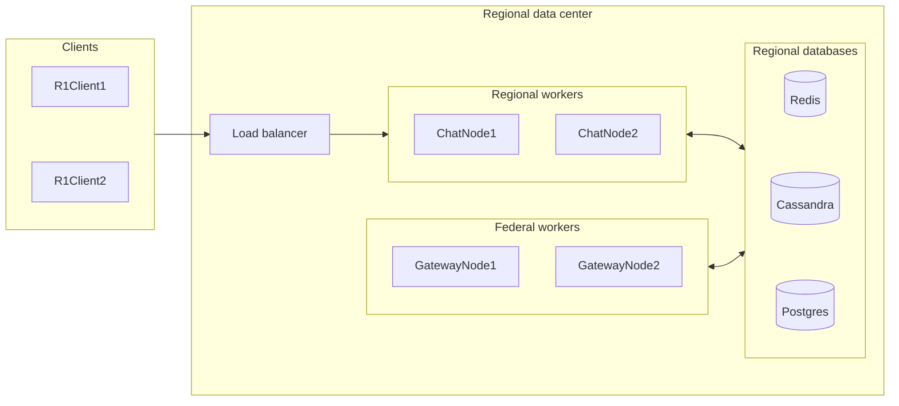
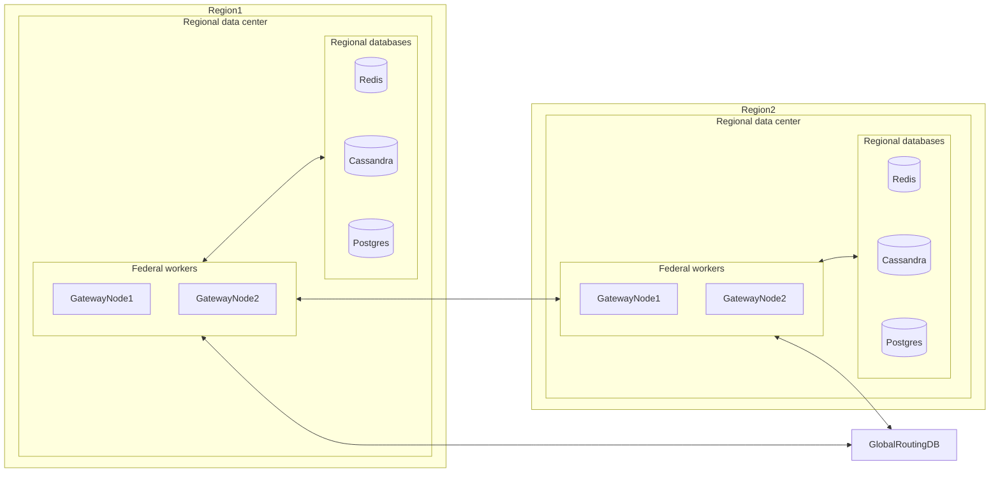

# What is Chattskiy?

Chattskiy is a distributed reactive chat backend built with Java and Spring WebFlux.

The project explores the engineering problems behind a horizontally scalable, high-loaded chat backend:
handling big numbers of simultaneous connections, reactive event processing, distributed session
management, cross-node event propagation, persistence, observability, and load testing.

# Why is Chattskiy?

Initially it was just a pet project to get familiarize with modern technologies, approaches and challenges in high-loaded distributed systems.
Now it's treated as my portfolio project.

Don't expect it to be in anywhere near production-ready state. It's a deliberate choice to make only the most intricate and challenging parts of backend of the application.
It lacks any API and services dedicated to register and manage user, no chat management API and no any client implementation.
These components are considered simple to implement yet quite time-consuming.

# The goal

So, our task is to make some backend of a [Telegram](https://telegram.org/)-like chat application.

Such app should be:
* usable across multiple regions
* efficiently handle variable amounts of simultaneous user connections with quite big span
* and yet still serve users with acceptable latency.

In more engineering terms it should be:
* distributed
* horizontally scalable
* responsive

# Architecture

> [!Note]
> This chapter contains only a big picture of architecture description. For more detailed architecture description and reasoning behind it see [ARCHITECTURE.md](docs/ARCHITECTURE.md)

## Tech stack

`Java`, `Spring Boot`, `Spring WebFlux`, `Project Reactor` - for node implementation 
`Redis` - for routing and its `pub/sub` for communications 
`Postgres`, `Cassandra` - as databases

## Big picture

### One giant diagram

```mermaid
graph LR;
    subgraph Region1
        subgraph R1Clients [Clients]
            R1Client1 & R1Client2
        end
        
        R1Clients --> R1LoadBalancer[Load balancer];
        subgraph R1DataCenter [Regional data center]
            subgraph R1RegionalWorkers [Regional workers]
                R1ChatNode1[ChatNode1] & R1ChatNodeN[ChatNode2];     
            end
            R1LoadBalancer --> R1RegionalWorkers;
            
            subgraph R1FederalWorkers [Federal workers]
                R1GatewayNode1[GatewayNode1];
                R1GatewayNode2[GatewayNode2];
            end
            
            R1RegionalWorkers & R1FederalWorkers <--> R1DataBases;

            subgraph R1DataBases [Regional databases]
                direction TD
                R1Redis@{shape: db, label: Redis};
                R1Cassandra@{shape: db, label: Cassandra};
                R1Postgres@{shape: db, label: Postgres};
            end
        end 
    end

    subgraph Region2
        R2Client1 & R2ClientN --> R2LoadBalancer[Load balancer];
        subgraph R2DataCenter [Regional data center]
            subgraph R2RegionalWorkers [Regional workers]
                R2ChatNode1[ChatNode1] & R2ChatNodeN[ChatNode2];
            end
            R2LoadBalancer --> R2RegionalWorkers;

            subgraph R2FederalWorkers [Federal workers]
                R2GatewayNode1[GatewayNode1];
                R2GatewayNode2[GatewayNode2];
            end

            R2RegionalWorkers & R2FederalWorkers <--> R2DataBases;

            subgraph R2DataBases [Regional databases]
                direction TD
                R2Redis@{shape: db, label: Redis};
                R2Cassandra@{shape: db, label: Cassandra};
                R2Postgres@{shape: db, label: Postgres};
            end
        end
    end
    
    R1FederalWorkers <-----> R2FederalWorkers
    R1FederalWorkers & R2FederalWorkers <--> GlobalRoutingDB;
```

### Regional Layer

As you can see, on a scale of one region we have regional users connected to some load balancer (For now Traefik is used for simplicity).

Load balancer then distributes users across multiple ChatNodes. 

ChatNodes are responsible for handling users websocket sessions and propagation of incoming (user sent) events across other workers (regional and federal).

GatewayNodes are responsible for handling cross-regional event handling and propagation (e.g. propagate MessageEvent to users from other regions).

Redis pub/sub is used for worker communication inside a region.

### Federal layer
> [!Important]
> Currently not implemented, but described and reasoned quite thoroughly in [ARCHITECTURE.md](docs/ARCHITECTURE.md#federal-layer)

As mentioned earlier, each user has its home region assigned and GatewayNodes are responsible for cross-regional communications. 
To locate home region of foreign users we have to introduce some centralized storage with routing `user -> home_region` mappings.

GatewayNode then can ask home region of user for required data (like regions where this user has active sessions).

Then, knowing all the necessary routing data, GatewayNode can communicate only with interested regions, and to be more specific, to their GatewayNodes.

# Observability

## Metrics
Spring Boot Actuator and Micrometer expose metrics. Prometheus collects them and Grafana visualizes them.

Custom histogram timers measure:

- **incoming**: event handling from receiving from client to publishing (a.k.a. event propagation);
- **publishing**: complete event publishing pipeline;
- **outside**: outside (propagated from other node) event processing until emission to a local session sink.

The timers are tagged by event type.

## Logging
Structured logging uses Spring's ECS logging support.

# Tests

Since the architecture is live and changes continuously, covering the whole project with tests would be wasteful and very time-consuming.

Yet, I wanted to show, I'm familiar with tests, and I can write them.
So I covered only the `ru.volkfm.chattskiy.service.sessionregistry` package + some load testing.

The project contains:

- plain JUnit unit tests;
- Mockito-based unit tests;
- Redis integration tests;
- Testcontainers-based integration testing;
- concurrency-sensitive session TTL tests;
- k6 WebSocket load tests.

## Current benchmark

3,000 concurrent WebSocket users across two application nodes, ~2,000 client-originated messages/sec and ~4,000 WebSocket messages/sec, on a Ryzen 5 3600 / 16 GB RAM development machine.

> [!Note]
> See more in [LOAD_TESTING.md](docs/LOAD_TESTING.md)

## Known limitations

- Redis Pub/Sub provides no durable delivery or replay.
- Session routing depends on TTL renewal.
- Cassandra and Redis are development-grade single-instance infrastructure in the local topology.
- Offline-message semantics and strong delivery guarantees are intentionally limited.
