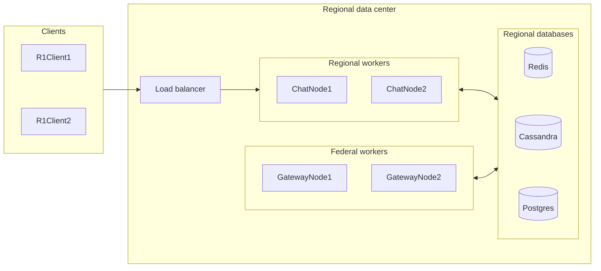
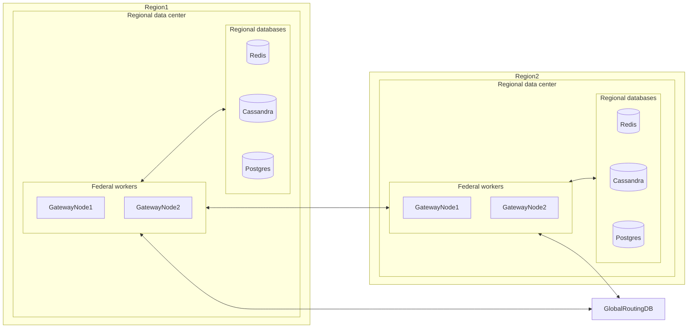

# Chattskiy Architecture

## 0. Notes for myself

Поймал себя на сысли, что гейтвей - не легкая история. Крч делаем пользователю домашний регион, где он зареган, например РУ.
Когда пользователь подключается в DE регионе, он эксплицитно говорит свой регион при авторизации. Мы с этими данными идем и копируем из РУ региона к нам в ДЕ запись о нём, но в РУ регионе он вечный, а в ДЕ с ТТЛом.

Делаем глобал лук ап таблицу юзер -> домашний регион.

Если пользователь уехал в IT регион и делает ауф там, IT регион сначала пробует ауфнуть локально, потом делает лукап домашнего региона (DE) и стучится в DE регион.
DE регион 1) делает ауф, и если всё чётко отдает данные юзера для кэша в IT регион. 2) Делает у себя в базе пометку, что у юзера есть активные сессии в IT регионе

Если юзер из FR шлёт сообщение юзеру из DE, а тот в IT. Тогда в FR сначала делает штатный региональный паблишинг. Если какие-то юзеры не нашлись, делегируем отправку в GwNode.
GwNode делает локальный лукап активных регионов пользователя. Нашел - хорошо, шлём им. Не нашел - фигово, глобал лукап домашнего региона, кэшим активные регионы из домашнего, шлём.

# Architecture

## Distributed

> [!Important]
> For now multi-regional data exchange is not implemented at all. The whole "Distributed" section for now is only the concept
> how it *should* work, explains all the tradeoffs and that it's possible and natural to evolve currently implemented part of Chattskiy app to provide multi-regional distribution.

Suppose, we have a chat with a user in the USA and another user in Germany. Each of them should have access to
chat history, ability to write messages and get notified about new messages in the chat.

Making our system reside in just a one big data center (DC) would increase latency for some users, and thus ruin the UX.
Another, better, approach is to distribute our app across multiple DCs and let each DC handle users closest to it.

> [!Note]
> Further on I'll be referring to the area covered by one DC and the DC itself as a region. So "DC covers a region" means that DC covers
> all (or at least most of) the clients residing in that region, and "data inside the region" means data inside the DC covering that region.

But then how do we distribute data across all the regions?
Again, storing all the data in one place is a bad idea, we have to store data in a distributed fashion.
We could store a full copy of all the data in each region, which theoretically is the fastest approach, but in reality it's impractically expensive.
Another approach is to store in each region only the regional data and then exchange it somehow between regions.
But then again, additional latency for cross-regional data exchange.
Which leaves us somwhere in between of global copy and local regional data storage. We should store regional data + some live nessecary part of data from other regions.

Summarizing it all, the final design is to use regional model, where each client has an assigned home region to it, that region is served by its own DC. All the regional data is stored on that DC.
* If we have a chat with participants from multiple regions, each region should have a live copy of the chat data.
* If the chat data is changed we should propagate this change to other interested regions.
* If user travels to other region and connects to other regions DC, other region should look up home region of the user (via some global routing DB) and
  ask home region for user data, which other region will cache. Home region in response should authorize user credentials, hand out user data to other region
  and store somewhere locally that this user have active sessions in that other region.

Since all the regions are mostly independent and data is redundant, in case of some region fails, we still be able to
serve all the clients. Even the ones from the failed region, provided we redistribute them to neighbouring regions for the time of maintenance.
Although not replicated regional data may be inaccessible and cached data in other regions may expire (require some additional handling in case of failure).

## Horizontally scaled

Alright, we distributed Chattskiy around the globe. But how exactly are we going to handle variable and sometimes high loads?
We could, of cource, introduce more regions, which means less users per region, but building new DCs every time is quite expensive.

That's where the ability to scale Chattskiy horizontally in just one DC comes handy. No need to build new DCs, just run more ChatNode instances and let new instances handle excessive users.

But then again, suppose, user1 is connected to node1 and user2 to node2, both are in the same chat. Then instances should be able to coordinate with other instances. Meaning, we have to introduce some means of cross-node communication.

Chattskiy is built in a modular fashion, so we could fairly easy swap cross-node communication implementation,
but currently Chattskiy uses Redis pub/sub for cross-node data exchange and Redis hashes for routing (!ToDo: link to registries).
Redis pub/sub is chosen because of its simplicity, low overhead and easy integration in the rest of the tech stack.
Yet, it lacks some handy functionality like data durability and replayability.

Besides, as far as I know Redis has some problems with scaling, which makes it one big potential bottleneck and point of failure.
Yet, although cross-node communication is a primary path of data processing, it's an optional optimization path.
The mandatory part of data processing is only to get, validate and persist it. So in case of Redis failure UX will become worse, but the app still stays usable. (!ToDo: link to failure scenarios)

## Responsive

Potentially we have to serve a lot of users simultaneously. Plus, we have to send data back and forth.
There are many suitable transports and protocols reliable, fast enough and with full duplex,
but for simplicity of implementation I chose WebSockets.

Since we have a lot of simultaneous connections with lightweight processing, traditional ways of Spring Web MVC (one thread per connection) suit poorly for our goals.
Luckily Netty and Spring WebFlux exist allowing us asynchronous connections processing, which allows us to handle much more connections per thread in reactive fashion.
The only downside is higher complexity of development.

## Visualizing and adding some details

Let's look at what we've discussed in one giant diagram and then split it into two smaller ones for better understanding.

### One giant diagram

```mermaid
graph LR;
    subgraph Region1
        subgraph R1Clients [Clients]
            R1Client1 & R1Client2
        end
        
        R1Clients --> R1LoadBalancer[Load balancer];
        subgraph R1DataCenter [Regional data center]
            subgraph R1RegionalWorkers [Regional workers]
                R1ChatNode1[ChatNode1] & R1ChatNodeN[ChatNode2];     
            end
            R1LoadBalancer --> R1RegionalWorkers;
            
            subgraph R1FederalWorkers [Federal workers]
                R1GatewayNode1[GatewayNode1];
                R1GatewayNode2[GatewayNode2];
            end
            
            R1RegionalWorkers & R1FederalWorkers <--> R1DataBases;

            subgraph R1DataBases [Regional databases]
                direction TD
                R1Redis@{shape: db, label: Redis};
                R1Cassandra@{shape: db, label: Cassandra};
                R1Postgres@{shape: db, label: Postgres};
            end
        end 
    end

    subgraph Region2
        R2Client1 & R2ClientN --> R2LoadBalancer[Load balancer];
        subgraph R2DataCenter [Regional data center]
            subgraph R2RegionalWorkers [Regional workers]
                R2ChatNode1[ChatNode1] & R2ChatNodeN[ChatNode2];
            end
            R2LoadBalancer --> R2RegionalWorkers;

            subgraph R2FederalWorkers [Federal workers]
                R2GatewayNode1[GatewayNode1];
                R2GatewayNode2[GatewayNode2];
            end

            R2RegionalWorkers & R2FederalWorkers <--> R2DataBases;

            subgraph R2DataBases [Regional databases]
                direction TD
                R2Redis@{shape: db, label: Redis};
                R2Cassandra@{shape: db, label: Cassandra};
                R2Postgres@{shape: db, label: Postgres};
            end
        end
    end
    
    R1FederalWorkers <-----> R2FederalWorkers
    R1FederalWorkers & R2FederalWorkers <--> GlobalRoutingDB;
```


### Regional Layer



As you can see, on a scale of one region we have regional users connected to some load balancer (For now Traefik is used for simplicity).

Load balancer then distributes users across multiple ChatNodes.

ChatNodes are responsible for handling users websocket sessions and propagation of incoming (user sent) events across other workers (regional and federal).

GatewayNodes are responsible for handling cross-regional event handling and propagation (e.g. propagate MessageEvent to users from other regions).

### Federal layer <a name="federal-layer"></a>



As mentions earlier, each user has its home region assigned and GatewayNodes are responsible for cross-regional communications.
To locate home region of foreign users we have to introduce some centralized storage with routing `user -> home_region` mappings.
Such database is read-heavy, but writes are very rare - only on newly registered users, home region changes and user deletions; these events are considered rare.
Again, it's a compromise.
We could broadcast our search query to all regions and aggregate responses, but that's traffic heavy.
We could store full live copies of this big mapping database in each region, but that's more data to store → more expenses on databases.

GatewayNode then can ask home region of user for required data (like regions where this user has active sessions).

Then, knowing all the necessary routing data, GatewayNode can communicate only with interested regions, and to be more specific, to their GatewayNodes.

## 1. Overview

Chattskiy is a horizontally scalable WebSocket application.

```text
                     Client
                       │
                    WebSocket
                       ▼
                    Traefik
                  /         \
                 ▼           ▼
          Chattskiy #1   Chattskiy #2
                 \           /
                  \         /
                     Redis
                       │
                   Cassandra
```

The actual WebSocket resources remain local to the JVM that owns them. Distributed state contains only routing information.

## 2. WebSocket lifecycle

`ChatWsHandler`:

1. obtains the authenticated user ID from the handshake;
2. registers the session;
3. creates the incoming event pipeline;
4. subscribes the outgoing WebSocket to the local session sink;
5. merges outgoing events with protocol/control messages;
6. unregisters the session when it terminates.

Conceptually:

```text
session.receive()
      │
      ▼
parse Event
      │
      ▼
EventHandler
      │
      ▼
publish

local session sink
      │
      ▼
session.send()
```

## 3. Local session registry

The local registry is conceptually:

```text
Map<UserId, Map<SessionId, LocalSession>>
```

`LocalSession` owns the JVM-local WebSocket sink.

Multiple sessions for one user are supported, for example a browser and a mobile client.

## 4. Global session registry

The global Redis-backed registry records which application nodes currently have active sessions for a user:

```text
user A → node-1
user A → node-2
user B → node-2
```

It never stores WebSocket objects.

Entries use TTLs. Connected sessions renew their TTL periodically. This avoids permanently retaining state for nodes that disappear unexpectedly.

A real debugging incident during development demonstrated why renewal is essential: expired registry entries caused event routing to find no active subscriptions even though the Redis listener itself remained healthy.

## 5. Event publishing

The publishing pipeline is approximately:

```text
PublishableEvent
      │
      ▼
chat participants
      │
      ▼
active nodes
      │
      ▼
distinct node IDs
      │
      ▼
Redis PUBLISH
```

The publisher does not directly access another node's WebSocket sessions.

## 6. Event listening

Each node subscribes to its relevant Redis channels:

```text
Redis Pub/Sub
      │
      ▼
ReactiveSubscription.Message
      │
      ▼
JSON deserialization
      │
      ▼
PublishableEvent
      │
      ▼
event processing
      │
      ▼
local session lookup
      │
      ▼
session sink
```

The listener is independent of any single WebSocket lifecycle.

## 7. Reactor Sinks

A local session sink bridges the independent Redis listener and WebSocket pipelines:

```text
Redis listener
      │
      │ emitNext()
      ▼
session sink
      │
      │ asFlux()
      ▼
WebSocket send()
```

This decoupling allows the Redis listener to remain continuously active while individual WebSocket sessions come and go.

The trade-off is backpressure behavior. If downstream consumption cannot keep up, the sink can report overflow. This was observed during single-node load testing around 2,600 VUs.

## 8. Redis

Redis provides:

1. ephemeral distributed session coordination;
2. inter-node Pub/Sub.

These have different semantics.

The registry is temporary state that can expire and be rebuilt. Pub/Sub messages are transient and are not replayable after subscriber loss.

## 9. Cassandra

Cassandra stores durable application data and is intentionally separate from live session routing.

This keeps the real-time path from requiring persistent storage for every session lookup.

Cassandra resource usage must still be considered during local load testing because it competes for the same physical machine resources as the application and other infrastructure.

## 10. Horizontal scaling

New nodes can accept WebSocket connections independently.

```text
                    Redis
                 /         \
                ▼           ▼
        node #1 registry   node #2 registry
              │                 │
              ▼                 ▼
        local sessions    local sessions
```

A message received by node 1 can therefore reach a user whose WebSocket is owned by node 2.

## 11. Example cross-node message

Alice is connected to node 1 and Bob to node 2:

```text
Alice
  │ MESSAGE
  ▼
Node 1
  │
  ├─ determine participants
  ├─ determine active nodes
  └─ Redis PUBLISH ─────► Node 2
                           │
                           ▼
                      EventListener
                           │
                           ▼
                      Bob's sink
                           │
                           ▼
                          Bob
```

## 12. Failure behavior

### Node failure

Local sessions disappear with the JVM. Global session entries eventually expire. Clients must reconnect.

### Redis failure

Inter-node event propagation and global session discovery are affected. Pub/Sub does not provide replay.

### Client disconnect

Normal cleanup removes the session. TTL provides a fallback for cases where cleanup cannot execute.

## 13. Why WebFlux?

The workload contains many long-lived WebSocket connections. Reactive I/O is a natural fit because the application can maintain many connections without requiring a permanently blocked thread per connection.

The reactive programming model also integrates naturally with reactive Redis and other non-blocking resources.

## 14. Why Redis Pub/Sub?

The requirement is lightweight inter-node event propagation, not durable event streaming.

Pub/Sub is simple and low-overhead, at the cost of persistence, replay, consumer offsets, and durable delivery guarantees.

## 15. Why local + global registries?

A WebSocket session is a process-local resource. Redis cannot own it.

The global registry therefore stores only enough information to route an event to the nodes that own relevant sessions.

## 16. Why TTL?

Session presence is temporary and process failure can prevent cleanup.

TTL turns stale distributed state into eventually self-cleaning state.

## 17. Observability

Micrometer timers measure three application boundaries:

```text
incoming
  └─ handler delegation → handler completion

publishing
  └─ publish() → publishing pipeline completion

outside
  └─ external event listener → local session sink emission
```

Prometheus collects the metrics and Grafana visualizes them.

## 18. Future evolution

If stronger delivery guarantees become necessary, Redis Pub/Sub could be replaced or supplemented by Redis Streams, Kafka, or another durable messaging system.

Production deployment would also require HA Redis/Cassandra rather than the single-instance development topology.
