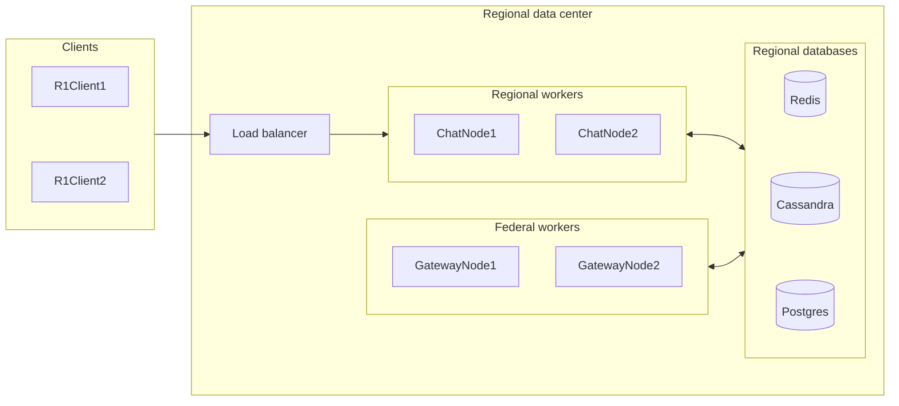
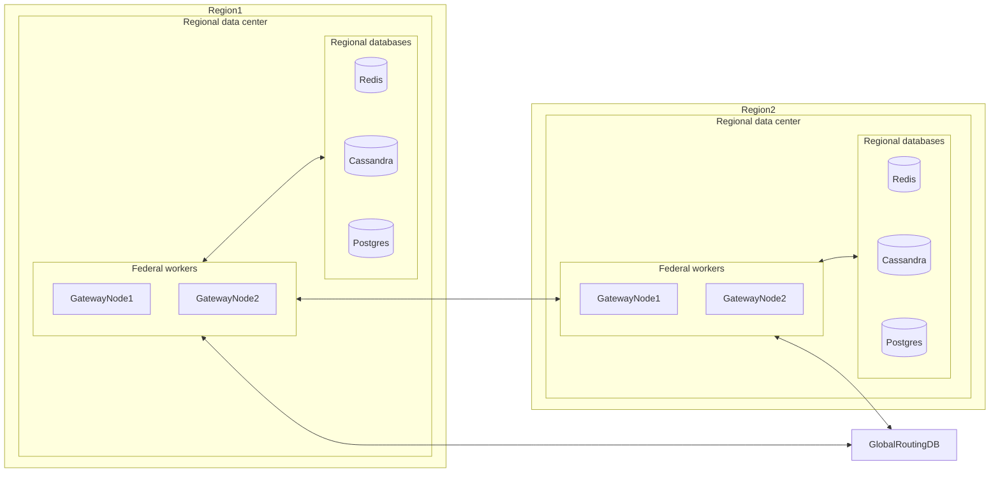
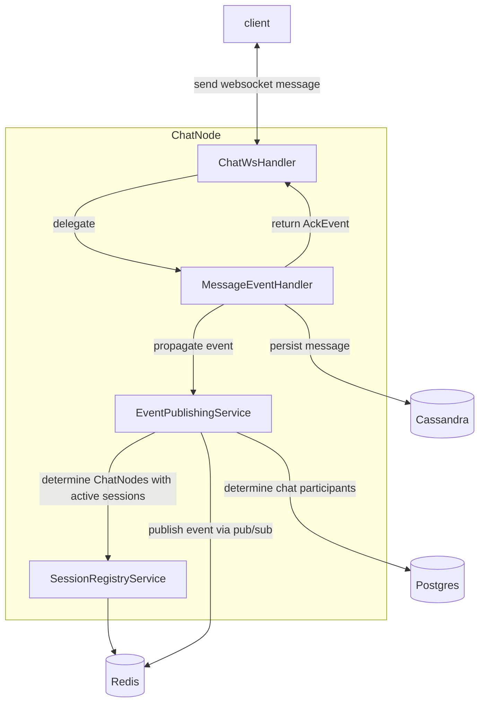
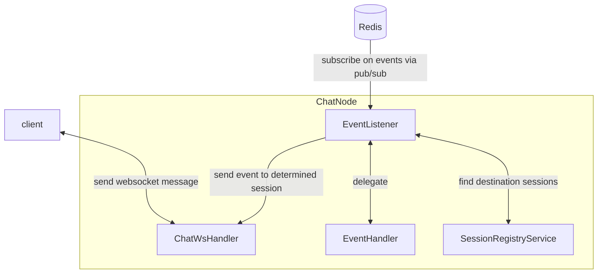

```mermaid
graph LR;
    subgraph Region1
        subgraph R1Clients [Clients]
            R1Client1 & R1Client2
        end
        
        R1Clients --> R1LoadBalancer[Load balancer];
        subgraph R1DataCenter [Regional data center]
            subgraph R1RegionalWorkers [Regional workers]
                R1ChatNode1[ChatNode1] & R1ChatNodeN[ChatNode2];     
            end
            R1LoadBalancer --> R1RegionalWorkers;
            
            subgraph R1FederalWorkers [Federal workers]
                R1GatewayNode1[GatewayNode1];
                R1GatewayNode2[GatewayNode2];
            end
            
            R1RegionalWorkers & R1FederalWorkers <--> R1DataBases;

            subgraph R1DataBases [Regional databases]
                direction TD
                R1Redis@{shape: db, label: Redis};
                R1Cassandra@{shape: db, label: Cassandra};
                R1Postgres@{shape: db, label: Postgres};
            end
        end 
    end

    subgraph Region2
        R2Client1 & R2ClientN --> R2LoadBalancer[Load balancer];
        subgraph R2DataCenter [Regional data center]
            subgraph R2RegionalWorkers [Regional workers]
                R2ChatNode1[ChatNode1] & R2ChatNodeN[ChatNode2];
            end
            R2LoadBalancer --> R2RegionalWorkers;

            subgraph R2FederalWorkers [Federal workers]
                R2GatewayNode1[GatewayNode1];
                R2GatewayNode2[GatewayNode2];
            end

            R2RegionalWorkers & R2FederalWorkers <--> R2DataBases;

            subgraph R2DataBases [Regional databases]
                direction TD
                R2Redis@{shape: db, label: Redis};
                R2Cassandra@{shape: db, label: Cassandra};
                R2Postgres@{shape: db, label: Postgres};
            end
        end
    end
    
    R1FederalWorkers <-----> R2FederalWorkers
    R1FederalWorkers & R2FederalWorkers <--> GlobalRoutingDB;
```

# The goal

So, our task is to make some backend of a [Telegram](https://telegram.org/)-like chat application.

Such app should be:
* usable across multiple regions
* efficiently handle variable amounts of simultaneous user connections with quite big span
* and yet still serve users with acceptable latency.

In more engineering terms it should be:
* distributed
* horizontally scalable
* responsive

# Chattskiy Architecture

## Concept

### Distributed

> [!Important]
> For now multi-regional data exchange is not implemented at all. The whole "Distributed" and "Federal layer" sections for now are only the concept
> how it *should* work, explains the tradeoffs and that it's possible and natural to evolve currently implemented part of Chattskiy app to provide multi-regional distribution.

Suppose, we have a chat with a user in the USA and another user in Germany. Each of them should have access to
chat history, ability to write messages and get notified about new messages in the chat.

Making our system reside in just a one big data center (DC) would increase latency for some users, and thus ruin the UX.
Another, better, approach is to distribute our app across multiple DCs and let each DC handle users closest to it.

> [!Note]
> Further on I'll be referring to the area covered by one DC and the DC itself as a region. So "DC covers a region" means that DC covers
> all (or at least most of) the clients residing in that region, and "data inside the region" means data inside the DC covering that region.

But then how do we distribute data across all the regions?
Again, storing all the data in one place is a bad idea, we have to store data in a distributed fashion.
We could store a full copy of all the data in each region, which theoretically is the fastest approach, but in reality it's impractically expensive.
Another approach is to store in each region only the regional data and then exchange it somehow between regions.
But then again, additional latency for cross-regional data exchange.
Which leaves us somwhere in between of global copy and local regional data storage. We should store regional data + some live nessecary part of data from other regions.

Summarizing it all, the final design is to use regional model, where each client has an assigned home region to it, that region is served by its own DC. All the regional data is stored on that DC.
* If we have a chat with participants from multiple regions, each region should have a live copy of the chat data.
* If the chat data is changed we should propagate this change to other interested regions.
* If user travels to other region and connects to other regions DC, other region should look up home region of the user (via some global routing DB) and
  ask home region for user data, which other region will cache. Home region in response should authorize user credentials, hand out user data to other region
  and store somewhere locally that this user have active sessions in that other region.

Since all the regions are mostly independent and data is redundant, in case of some region fails, we still be able to
serve all the clients. Even the ones from the failed region, provided we redistribute them to neighbouring regions for the time of maintenance.
Although not replicated regional data may be inaccessible and cached data in other regions may expire (require some additional handling in case of failure).

### Horizontally scaled

Alright, we distributed Chattskiy around the globe. But how exactly are we going to handle variable and sometimes high loads?
We could, of cource, introduce more regions, which means less users per region, but building new DCs every time is quite expensive.

That's where the ability to scale Chattskiy horizontally in just one DC comes handy. No need to build new DCs, just run more ChatNode instances and let new instances handle excessive users.

But then again, suppose, user1 is connected to node1 and user2 to node2, both are in the same chat. Then instances should be able to coordinate with other instances. Meaning, we have to introduce some means of cross-node communication.

Chattskiy is built in modular fashion, so we could fairly easy swap cross-node communication implementation,
but currently Chattskiy uses Redis pub/sub for cross-node data exchange and Redis hashes for routing (see [GlobalSessionRegistryService](#client-connection)).
Redis pub/sub is chosen because of its simplicity, low overhead and easy integration in the rest of the tech stack.
Yet, it lacks some handy functionality like data durability and replayability.

Besides, as far as I know Redis has some problems with scaling, which makes it one big potential bottleneck and point of failure.
Yet, although cross-node communication is a primary path of data processing, it's an optional optimization path.
The mandatory part of data processing is only to get, validate and persist it. So in case of Redis failure UX will become worse, but the app still stays usable. (see [Failure behaviour](#failure-behavior))

### Responsive

Potentially we have to serve a lot of users simultaneously. Plus, we have to send data back and forth.
There are many suitable transports and protocols reliable, fast enough and with full duplex,
but for simplicity of implementation I chose WebSockets.

Since we have a lot of simultaneous connections with lightweight processing, traditional ways of Spring Web MVC (one thread per connection) suit poorly for our goals.
Luckily Netty and Spring WebFlux exist allowing us asynchronous connections processing, which allows us to handle much more connections per thread in reactive fashion.
The only downside is higher complexity of development.

### Visualizing and adding some details

Let's look at what we've discussed in one giant diagram and then split it into two smaller ones for better understanding.

#### One giant diagram

#### Regional Layer

As you can see, on a scale of one region we have regional users connected to some load balancer (For now Traefik is used for simplicity).

Load balancer then distributes users across multiple ChatNodes.

ChatNodes are responsible for handling users websocket sessions and propagation of incoming (user sent) events across other workers (regional and federal).

GatewayNodes are responsible for handling cross-regional event handling and propagation (e.g. propagate MessageEvent to users from other regions).

Redis stores the distributed session-routing information and transports events between nodes.

Cassandra stores durable chat data.

And Postgres stores chat and user data (names, ids, etc.)

##### Federal layer 

As mentions earlier, each user has its home region assigned and GatewayNodes are responsible for cross-regional communications.
To locate home region of foreign users we have to introduce some centralized storage with routing `user -> home_region` mappings.
Such database is read-heavy, but writes are very rare - only on newly registered users, home region changes and user deletions; these events are considered rare.
Again, it's a compromise.
We could broadcast our search query to all regions and aggregate responses, but that's traffic heavy.
We could store full live copies of this big mapping database in each region, but that's more data to store → more expenses on databases.

GatewayNode then can ask home region of user for required data (like regions where this user has active sessions).

Then, knowing all the necessary routing data, GatewayNode can communicate only with interested regions, and to be more specific, to their GatewayNodes.

## Tech stack

`Java`, `Spring Boot`, `Spring WebFlux`, `Project Reactor` - for node implementation 
`Redis` - for routing and its `pub/sub` for communications 
`Postgres`, `Cassandra` - as databases

## ChatNode implementation details

### Client connection
When client connects, a regular HTTP connection is established during handshake phase, which then upgrades to a websocket connection.

During the handshake phase ChatNode authorizes user and registers a new session in a [SessionRegistyService](../src/main/java/ru/volkfm/chattskiy/service/sessionregistry/SessionRegistryService.java)

`SessionRegistryService` then registers our new session in two registries:
* [LocalSessionRegistryService](../src/main/java/ru/volkfm/chattskiy/service/sessionregistry/LocalSessionRegistryService.java) - stores locally all the [sessions](../src/main/java/ru/volkfm/chattskiy/service/sessionregistry/LocalSession.java) handled by this ChatNode
* [GlobalSessionRegistryService](../src/main/java/ru/volkfm/chattskiy/service/sessionregistry/GlobalSessionRegistryService.java) - provides access to regional session storage (Redis)

Each session in `LocalSessionRegistryService` is represented by [LocalSession](../src/main/java/ru/volkfm/chattskiy/service/sessionregistry/LocalSession.java) object and contains a [Sink](https://projectreactor.io/docs/core/release/reference/coreFeatures/sinks.html) to sessions websocket connection.
This allows us to talk back to user in a detached manner.

`GlobalSessionRegistryService` stores a [hash](https://redis.io/docs/latest/develop/data-types/hashes/) for each user
with key-value pairs of `sessionId -> serving ChatNodeId`. Each key-value pair has TTL to eliminate stale sessions.

During the whole session ChatNode periodically sends PINGs to a client. Then a client has to send PONG back.
When ChatNode resieves PONG, it renews session TTL via `SesssionRegistrySerivce` (which in turn delegates renewal to `GlovalSessionRegistryService`).

Upon closing the connection, we try to unregister the session via `SessionRegistryService`.

### Event handling

I chose the whole system to be event driven. For now the only meaningful event type is MessageEvent, so let's study event processing pipeline on its example.

Its typical event flow looks like this:

#### Incoming event handling

1) Client sends a MessageEvent to ChatNode.
2) `ChatWsHandler` handles received websocket message, deserializes it, identifies it as event and delegates event handling to a corresponding `EventHandler` (`MessageEventHandler` in our case).
3) `MessageEventHandler` first of all validates and persists received message in Cassandra and returns AckEvent back to ChatWsHandler. 
Then, as <u>optional optimization</u> propagates the event via EventPublishingService.  
4) `ChatWsHandler` transforms AckEvent into websocket message and sends it back to client.

> [!Note]
> Event propagation for MessageEvent, although considered as main flow, still is treated as optional optimization.
> The mandatory part is only persist message and return AckEvent.
> In case of event propagation failure user still can retrieve messages from Cassandra via regular CRUD API (Not Implemented for simplicity reasons). 

3. 1. `EventPublishingService` gets the event to propagate, by its `ChatId` retrieves chat participants from Postgres DB and enriches the event with recipients list.
   2. Knowing a list of event recipients (chat participants), it determines nodes, which handle these recipients sessions, via `SessionRegistryService`.
   3. Then it sends the event to channels of interested nodes via Redis pub/sub
   
#### Outside event handling

On the receiving side of ChatNode is `EventListener` listening ChatNodes personal channel for outside events.

When it gets an event, it

1) Optionally delegates event handling to corresponding `EventHandler`.
2) Retrieves active sessions of event recipients from SessionRegistry.
3) For each retrieved session, emits a copy of event to session `Sink`.

That `Sink` on the other side is connected to "outside events" pipeline in `ChatWsHandler`.
`ChatWsHandler` transforms this event into websocket message and sends it to a client.

# Failure behavior

### Node failure

Local sessions disappear with the JVM. Global session entries eventually expire. Clients must reconnect.
But the application is still stable.

### Redis failure

Cross-node event propagation and global session discovery are affected. Pub/Sub does not provide replay.
Clients can't receive events in real-time and must instead periodically do manual sync via some Cassandra CRUD API.

UX gets worse, but the application is still in usable state.

### Postgres / Cassandra failure

No access to regional data. Praying and counting on replica-nodes.
Otherwise, the whole region is in a failed state and requires maintenance.

### Client disconnect

Normal cleanup removes the session. TTL provides a fallback for cases where cleanup cannot execute.
